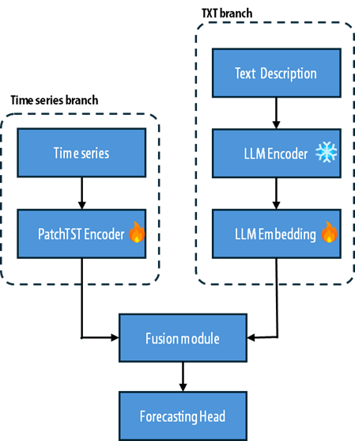
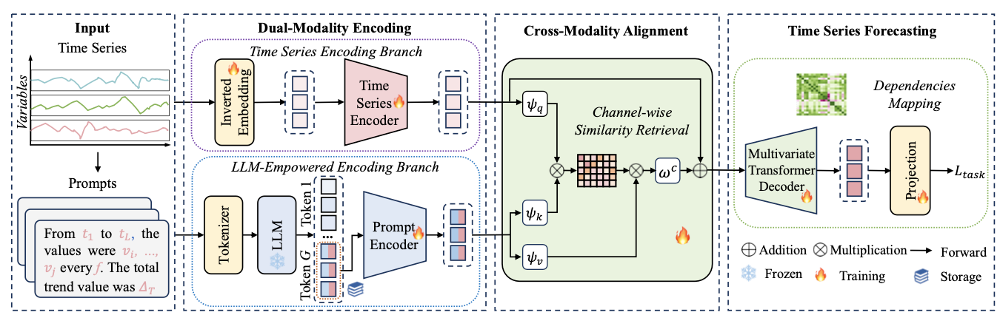
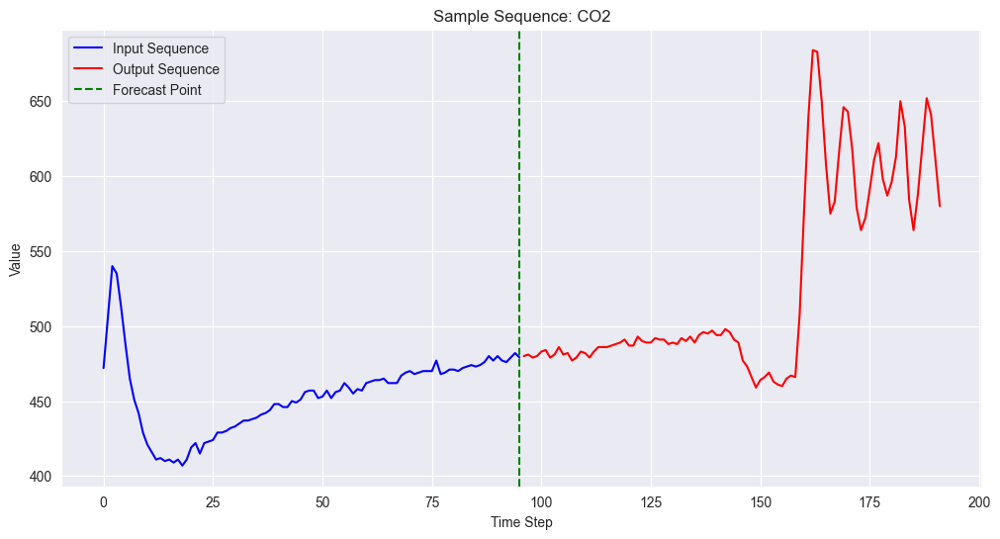
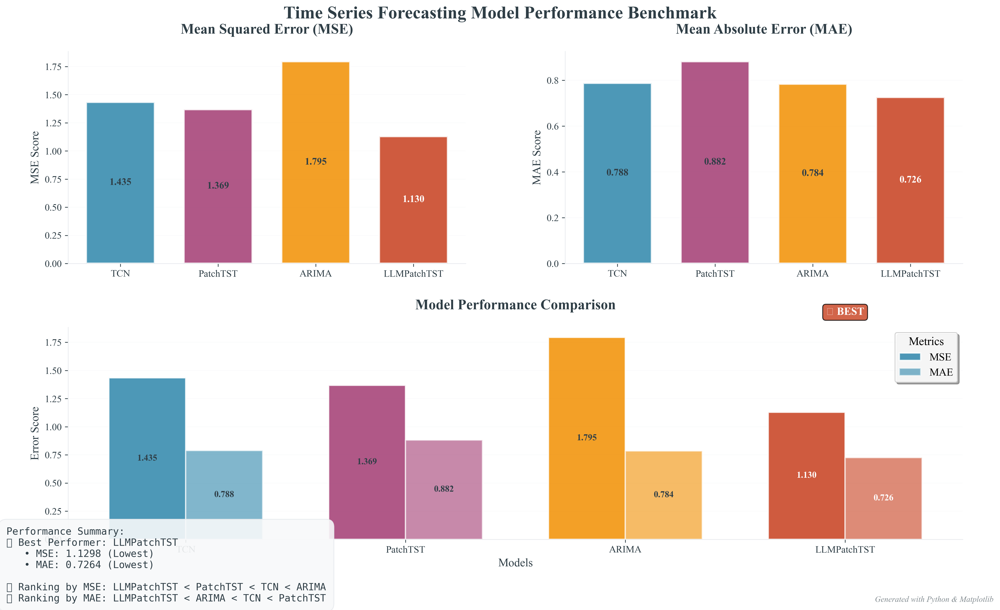

# Time Series Forecasting for Agricultural Sensor Data
Time series forecasting is vital for optimizing smart farming operations, 
yet traditional methods often falter with complex agricultural data. 
This paper proposes a novel hybrid model integrating a time series uni-model with a Large Language Model (LLM) via prompt embedding, enabling multimodal forecasting:



## Table of Contents
- [Models](#models)
  - [Benchmark Models](#benchmark-models)
  - [Main Model: TimeCMA](#main-model-timecma)
- [Dataset](#dataset)
- [Getting Started](#getting-started)
  - [Prerequisites](#prerequisites)
  - [Installation](#installation)
- [Running Experiments](#running-experiments)
  - [Benchmark Models](#running-benchmark-models)
  - [TimeCMA Model](#running-timecma-model)
- [Results](#results)

## I. Models

### Benchmark Models

#### 1. TCN (Temporal Convolutional Network)
TCN uses dilated causal convolutions to capture long-range dependencies in time series data. The model architecture includes:
- Temporal blocks with residual connections
- Increasing dilation rates to expand the receptive field


#### 2. PatchTST (Patch-based Time Series Transformer)
PatchTST divides time series into patches and processes them using a Transformer architecture:
- Patch embedding that segments time series into patches
- Self-attention mechanisms to capture dependencies between patches
- Normalization and denormalization steps for stable training


#### 3. Statistical Models
The project includes several statistical forecasting methods:
- Naive Last: Uses the last value for all future predictions
- Naive Mean: Uses the mean of the input sequence for all predictions
- Naive Seasonal: Uses values from the last season
- Drift: Linear extrapolation based on the first and last points
- ARIMA: AutoRegressive Integrated Moving Average model


### Main Model: TimeCMA

TimeCMA (Time Series Cross-Modal Alignment) is the main model of this project, featuring:
- Dual-encoder architecture with time series and prompt encoders
- Cross-modal alignment between time series data and embeddings
- Transformer decoder for generating predictions
- Normalization layers for stable training
  
Details of the architecture can be found in the [TimeCMA](https://github.com/ChenxiLiu-HNU/TimeCMA)



## II. Dataset

The dataset consists of real-world sensor data collected from agricultural environments. It includes:

- **Farm9.csv**: The main dataset containing:
  - CO2 levels
  - Temperature
  - Humidity
  - Sun measurements (from multiple sensors)
  - Timestamps at 5-minute intervals

- **data4features.csv**: A subset with 4 selected features

The data has been preprocessed and can be visualized using the provided [notebook files]([data_visualization.ipynb](notebooks/data_visualization.ipynb)) to explore patterns and characteristics.



## Getting Started

### Prerequisites

- Python 3.6+
- PyTorch 1.8+
- CUDA (for GPU acceleration)
- Additional dependencies listed in requirements.txt

### Installation

1. Clone the repository:
```bash
git clone https://github.com/yourusername/FarmAI.git
cd FarmAI
```

2. Install dependencies:
```bash
pip install -r requirements.txt
```

## Running Experiments

### Running Benchmark Models

The benchmark models (TCN, Transformer, PatchTST, Statistical Models) can be run using the provided Jupyter notebooks:

1. Open the notebook for the desired model:
```bash
jupyter notebook notebooks/tcn_experiment-4-features.ipynb
```

2. Follow the steps in the notebook to:
   - Load and explore the dataset
   - Configure the model parameters
   - Train the model
   - Evaluate and visualize results

Each notebook provides a comprehensive guide to running experiments with the respective model.

### Running TimeCMA Model

The TimeCMA model can be run using the experiment.py script or shell commands. 


1. Basic usage:
```bash
python experiment.py --is_training 1 --config models/TimeCMA --experiment multivariate
```

2. shell command for training :
```bash
sh scripts/farm.sh
```


## Results

The performance of different models can be compared using various metrics:
- MAE (Mean Absolute Error)
- MSE (Mean Squared Error)
- RMSE (Root Mean Squared Error)
- MAPE (Mean Absolute Percentage Error)

Results are saved in the `experiments/results/` directory and can be visualized using the provided notebooks.



---

For more details, please refer to the paper.
